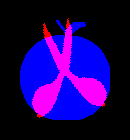

# MaxOverlap

## Introduction

​	To generate a dataset, in which each entry contains two shapes(lock, key), and the max overlap area of the two shapes.




​	The dataset comes into being as follows:

1. Select a set of primitive shapes from exiting shape dataset.
2. Preprocess these primitive shapes into a regular format.
3. Calculate and save the max overlap area between each pair of primitive shapes.
4. Generate the dataset from primitive shapes and max overlap area by randomly transforming primitive shapes.

## Primitive Shapes

​	This dataset contains 775 primitive shapes gathered from several different shape dataset:

1. [MPEG 7 Shape Matching](http://www.dabi.temple.edu/~shape/MPEG7/dataset.html)
2. [Animal Dataset](https://sites.google.com/site/xiangbai/animaldataset)
3. [Kimia](http://vision.lems.brown.edu/content/available-software-and-databases)
4. [Myth, Tools](http://tosca.cs.technion.ac.il/book/resources_data.html)

  ​Folder `source` contains images copied from the original dataset. Then you can run `gen_primitives.py` to generate the uniformed primitive shapes.

```bash
python gen_primitives.py
```

​	**Or you can use `filled_primitives` or `hollow_primitives` directly**. 

​	Note: some of shapes in the original dataset are hollow. In `filled_primitives`, most of these holes are filled by `cv2.drawContours`. 

## Calculate Max Overlap Area

### Evolutionary Algorithm

​	This is the most time-consuming part in the whole process. I use the evolutionary algorithm to gain precise results efficiently. The library I used are [`DEAP`](https://github.com/DEAP/deap) and [`SCOOP`](https://github.com/soravux/scoop/).

​	You can use the Python wrapper `gen_max_areas.py` to generate the max overlap areas file, `filled_max_areas` and `hollow_max_areas`. In order to use `SCOOP` multi-process library, make sure you run the `gen_max_areas.py` in the following way. This is significant for efficiency.

```bash
python -m scoop gen_max_areas.py
```

​	When you need to use the generated `*_max_areas` file, you can use the following script in your own code.

```python
import pickle
import numpy as np
with open('filled_max_areas') as fp:
    areas_mat = np.array(pickle.load(fp), dtype=np.int)
```

​	`areas_mat` is a symmetric matrix containing the max overlap between primitive shape pairs. Here is an example:

```
6450    2240    2264
2240    3120    1650
2264    1650    2893

# The max overlap area between 0.png and 1.png is 2240
# The max overlap area between 0.png and 2.png is 2264
# The max overlap area between 1.png and 2.png is 1650
```

### Legacy

​	I used to use exhaust algorithm to calculate the max overlap area. It was not only time consuming, but also imprecise. You can find the code in `legacy` folder. Here is how to use it.

​	~~I use c++ instead of python to implement the core function, `max_overlap_area`. You can compile the shared library by running this script in terminal. Note: Make sure you have installed **OpenCV** and **TBB** and configured them properly.~~

```bash
cd MaxOverlap/legacy
g++ `pkg-config --cflags opencv` ./cpp/max_overlap_area.cpp -ltbb `pkg-config --libs opencv` -fPIC -shared -o ./max_overlap_area.so
```

​	~~Then you can use the Python wrapper `gen_max_areas.py` to generate the max overlap areas file, `filled_max_areas` and `hollow_max_areas`.~~

## Generate Dataset

```bash
python -m scoop gen_dataset.py
```

