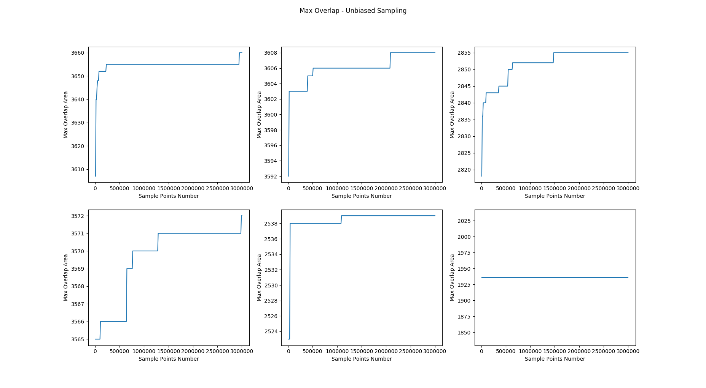
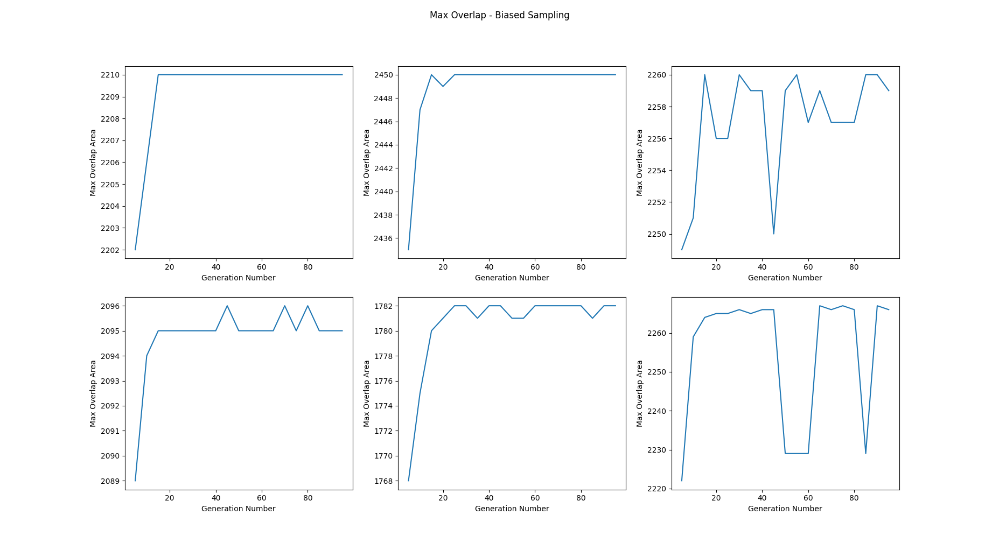
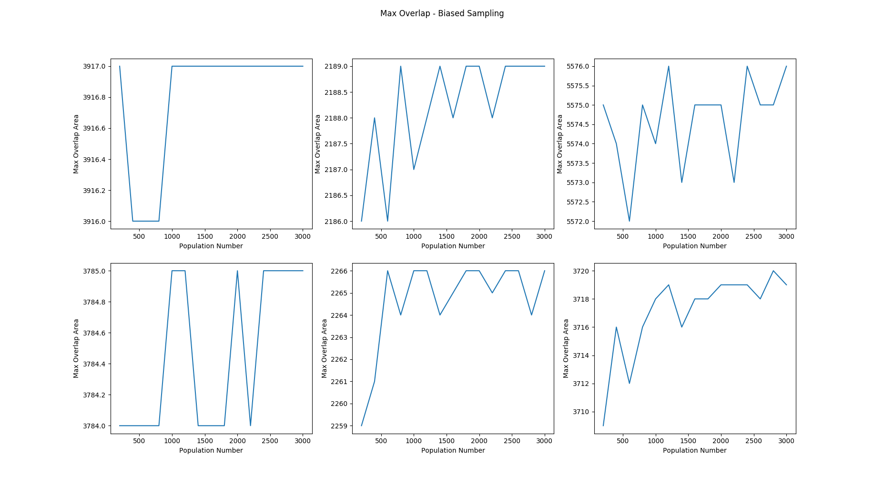

# Max Overlap Dataset

## Introduction

This task is to generate a dataset, in which each entry contains two shapes(lock, key), and the max overlap area of the two shapes.


The dataset comes into being as follows:

1. Select a set of primitive shapes from exiting shape dataset.
2. Preprocess these primitive shapes into a regular format.
3. Calculate and save the max overlap area between each pair of primitive shapes.
4. Generate the dataset from primitive shapes and max overlap area by randomly transforming primitive shapes.

## How to use

```bash
pip install opencv-python, numpy, pickle, scoop
```

```bash
git clone https://github.com/bigfacebear/MaxOverlap.git
cd MaxOverlap

# set generation parameters in gen_dataset_flags.py

python -m scoop gen_dataset.py
```

Then you get a folder containing pairs of shapes and a file `OVERLAP_AREAS`. `OVERLAP_AREAS` contains the max overlap area between each pair, and you can use it as following.

```python
import pickle

with open('OVERLAP_AREAS') as fp:
    overlap_area_list = pickle.load(fp)
```

## Primitive Shapes

This dataset contains 775 primitive shapes gathered from several different shape dataset:

1. [MPEG 7 Shape Matching](http://www.dabi.temple.edu/~shape/MPEG7/dataset.html)
2. [Animal Dataset](https://sites.google.com/site/xiangbai/animaldataset)
3. [Kimia](http://vision.lems.brown.edu/content/available-software-and-databases)
4. [Myth, Tools](http://tosca.cs.technion.ac.il/book/resources_data.html)


**You can use `filled_primitives` or `hollow_primitives` directly**. 

## Calculate Max Overlap Area

### Evolutionary Algorithm

This is the most time-consuming part in the whole process. I use the evolutionary algorithm to gain precise results efficiently. The library I used are [`DEAP`](https://github.com/DEAP/deap) and [`SCOOP`](https://github.com/soravux/scoop/).

You can use the Python wrapper `gen_max_areas.py` to generate the max overlap areas file, `filled_max_areas` and `hollow_max_areas`. In order to use `SCOOP` multi-process library, make sure you run the `gen_max_areas.py` in the following way. This is significant for efficiency.

```bash
python -m scoop gen_max_areas.py
```

When you need to use the generated `*_max_areas` file, you can use the following script in your own code.

```python
import pickle
import numpy as np
with open('filled_max_areas') as fp:
    areas_mat = np.array(pickle.load(fp), dtype=np.int)
```

`areas_mat` is a symmetric matrix containing the max overlap between primitive shape pairs. Here is an example:

```
6450    2240    2264
2240    3120    1650
2264    1650    2893

# The max overlap area between 0.png and 1.png is 2240
# The max overlap area between 0.png and 2.png is 2264
# The max overlap area between 1.png and 2.png is 1650
```

### Precision Analysis

#### The Comparison between biased and unbiased sampling

Evolutionary algorithm is a biased sampling, while we can also use unbiased sampling to estimate the max overlap area. But according to my experiment, biased sampling outperform unbiased sampling both in precision and efficiency.

Here is how the max overlap areas gained by biased and unbiased sampling grow as sample points number change. I randomly choose 6 pairs of shapes to test. 



 In unbiased sampling, the plot is a result of 300 independent sampling procedures each with a growing number of 10000 samples.



In biased sampling, the number of sample points is decided by generation number and population size. This plot shows the output max overlap area gotten by different generation number (and the population size is fixed as 1200). From this plot, the conclusion can be drawn that 20 generation is enough to generate good result.



This plot shows the relationship between max overlap area and population size in biased sampling with generation number is fixed as 20. It shows that population with size of 1200 is enough. So I pick 20 generation number and 1200 population size as parameters to generate precise results efficiently.

These plots show that unbiased sampling method need a great number of sample points to stably get a precise result. But biased sampling need less sample points (calculated roughly by $generation\ number \times population$).

Then I choose a subset of shape pairs with size of 1000 pairs, using both biased and unbiased sampling with 24000 sample points to estimate the max overlap area. Every time estimating the max overlap area of a new pair of input shapes, a new set of 1200 * 20 = 24000 sample points will be randomly generated in unbiased sampling. As for biased sampling, evolutionary algorithm, there are 1200 sample points per generation and there are 20 generations in total. Sample points in one generation is derived from the former generation by crossover and mutation. Here is the difference between results gained by biased and unbiased sampling.


The max overlap area gained by unbiased sampling is 36.33 pixels larger than biased sampling, and the max difference is up to 636.

In conclusion, biased sampling would be better in the continuing generation.

### The Comparison between biased sampling and ground truth

To get the approximating ground truth, I run the biased sampling on the given set of pairs for 100 times and choose max values. Then I use this set of ground truth value to evaluate the precision of my dataset generated by biased sampling. 

Here is the histogram that illustrate the difference between results gained by ground truth and biased sampling.


The result shows that the average error is 1.36 pixels and the standard deviation is 2.77. Most of the errors are within 10 pixels, and There are only 2/1000=0.2% pairs have error more than 20 pixels.

## Generate Dataset

```bash
python -m scoop gen_dataset.py
```

